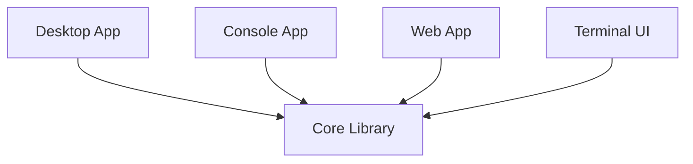

# Username Generator
## Overview

This is a set of applications to generate usernames in a title-case format (e.g. "WordWord") with greater customization such as character count and number of syllables per word.

The default word data was sourced from [EddyDN's JSON version](https://github.com/eddydn/DictionaryDatabase) of the public domain [Online Plain Text English Dictionary](https://www.mso.anu.edu.au/~ralph/OPTED/).

## Architecture

There are currently four types of available user interfaces: a basic Console app, a Desktop app, a local web UI, and a Terminal UI. All four of these share and reuse the same core library.

### Console

### Desktop

### Web

Dark Theme                |  Light Theme
:-------------------------:|:-------------------------:
 | 

 
### Terminal UI

## Usage

1. Install the .NET 6 SDK  
2. Clone the repository locally
3. Navigate to the cloned folder in the filesystem and open the project UI you would like to run (Basic Console, Desktop, Local Web, Terminal User Interface)
3. Run `dotnet run` in a terminal

## Using your own Data

If you'd like to use your own word list, the core library also includes a class titled `SyllableWriter` which contains a pair of methods that can be used to generate syllable counts from an existing word list.

## Known Bugs

- English is a language that often doesn't play by a consistent set of phonetic rules, and as a result the count of syllables detected may be occasionally off by one based on the word endings.
